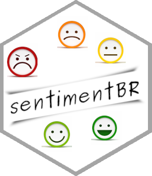

# sentimentBR 

<!-- badges: start -->

[](https://cran.r-project.org/package=sentimentBR)
[](https://cran.r-project.org/package=sentimentBR)
<!-- badges: end -->

Última Atualização: 12-06-2021

## Visão geral

No CRAN do R, existe um pacote arquivado denominado
[sentiment](https://cran.r-project.org/web/packages/sentiment/index.html),
no qual é possível baixar e fazer uma análise de sentimento em
**Inglês**. Então, inspirado nesse pacote, foram replicadas as funções
existentes, entretanto adicionando o dicionário da **língua
portuguesa**, mais precisamente do Brasil.

Este é um *pacote inicial* com o intuito de juntar as funções e
dicionários cada vez mais em português para que seja possível realizar
uma **Análise de Sentimento** cada vez mais eficiente e com boa
confiabilidade.

Foi mantido o nome do pacote e o nome do pimeiro autor nas partes dos
códigos que foram replicados nesse pacote. Foi adicionado o BR de Brasil
no fim do nome para dar ênfase ao sentido de replicar as funções para
utilizar na língua portuguesa. É importante deixar claro, que também é
possível utilizar as funções na língua **inglesa**, como existe no
pacote original arquivado.

## Instalação

``` r
# Instalação utilizando o pacote devtools
install.packages("devtools")
devtools::install_github("jodavid/sentimentBR")
```

## Utilização

``` r
# Pacote
library(sentimentBR)

# Texto a ser classficado
documento <- c("A alegria que se tem em pensar e aprender faz-nos pensar e aprender ainda mais.",
               "Um pouco de desprezo economiza bastante ódio.",
               "Não crie limites para si mesmo. Você deve ir tão longe quanto sua mente permitir. O que você mais quer pode ser conquistado.",
               "Pessoas vencedoras não são aquelas que não falham, são aquelas que não desistem")

# Classificando Emoções
classify_emotion(documento,algorithm="bayes",verbose=FALSE, lang = "pt")
#>      RAIVA              DESGOSTO           MEDO              
#> [1,] "9.6244348067824"  "2.61502587407376" "17.0176979015462"
#> [2,] "16.953528543029"  "9.6244348067824"  "17.0176979015462"
#> [3,] "16.953528543029"  "2.61502587407376" "9.6244348067824" 
#> [4,] "2.29534107053581" "2.61502587407376" "2.23117171201856"
#>      ALEGRIA            TRISTEZA           SURPRESA          
#> [1,] "23.7177293624799" "16.8636497805622" "16.0460570745889"
#> [2,] "9.6244348067824"  "9.6244348067824"  "9.6244348067824" 
#> [3,] "16.6710820846312" "24.102864754342"  "9.6244348067824" 
#> [4,] "9.6244348067824"  "2.3852198330026"  "3.20281253897588"
#>      CONFIANÇA          POSITIVA           NEGATIVA          
#> [1,] "16.7400169329669" "17.3703030365747" "9.6244348067824" 
#> [2,] "2.50885268059795" "1.87856657699013" "17.7333589627577"
#> [3,] "9.6244348067824"  "17.3703030365747" "25.8422831187331"
#> [4,] "2.50885268059795" "1.87856657699013" "9.6244348067824" 
#>      ANTECIPAÇÃO        BEST_FIT     
#> [1,] "23.0888562197168" "alegria"    
#> [2,] "9.6244348067824"  "negativa"   
#> [3,] "36.5532776326512" "antecipação"
#> [4,] "9.6244348067824"  "alegria"

# Classificando Polaridade
classify_polarity(documento,algorithm="bayes",verbose=FALSE, lang = "pt")
#>      POS                NEG                 POS/NEG             BEST_FIT  
#> [1,] "9.47547003995745" "0.445453222112551" "21.2715265477714"  "positive"
#> [2,] "9.47547003995745" "27.5355036756473"  "0.344118275502535" "negative"
#> [3,] "17.2265151579293" "8.78232285939751"  "1.96149873259283"  "neutral" 
#> [4,] "9.47547003995745" "0.445453222112551" "21.2715265477714"  "positive"
```

## Atualizações:

-   **05.06.2021**: Primeiro envio com as funções iniciais.

-   **12.06.2021**: Aumento do dicionário para emoções e inclusão de
    quatro novas classes de classificação.

Um post iniciando com Scraping e concluíndo com alguns gráficos para
análisar os sentimentos de textos pode ser encontrado no meu blog:
<https://jodavid.github.io/post/>
